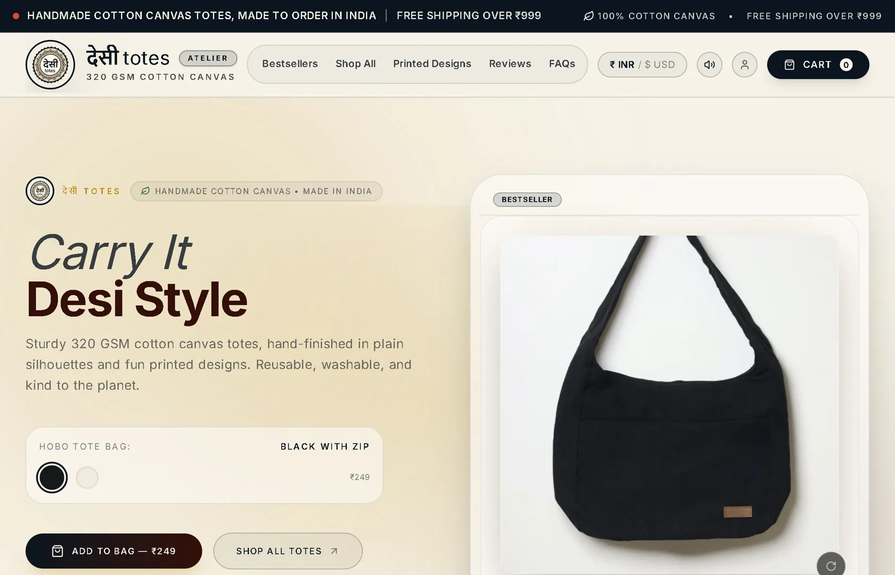
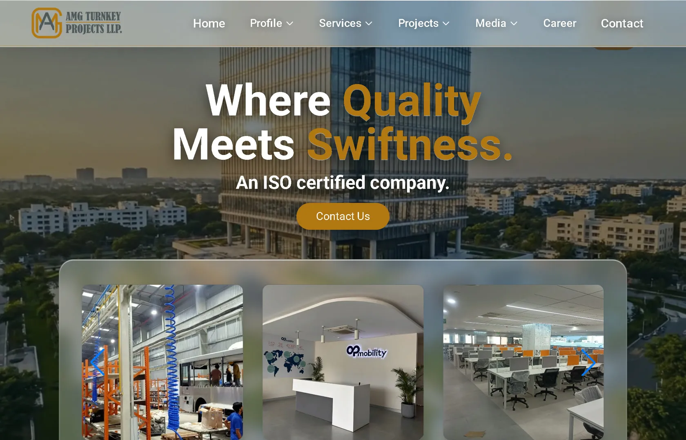

<picture>
  <source media="(prefers-color-scheme: dark)" srcset="assets/header-dark.svg">
  
</picture>

  <a href="https://portfolio-q38w.vercel.app"><b>Portfolio</b></a>&ensp;/&ensp;
  <a href="https://portfolio-q38w.vercel.app/cv">Resume</a>&ensp;/&ensp;
  <a href="mailto:sahilpathak2005@gmail.com">sahilpathak2005@gmail.com</a>&ensp;/&ensp;
  <a href="https://www.linkedin.com/in/sahil-pathak-98a523202">LinkedIn</a>

I build the surface and the thing underneath it, and I stay on afterwards. Final year of a B.Tech in computer science, with a BSc (Hons) in data science and AI at IIT Guwahati alongside it. Open to AI/ML and full-stack roles, based in Pune.

## In production

<!-- status:start -->
| | Live site | What it is | Last answer |
|:-:|---|---|--:|
|  | [desitotes.com](https://desitotes.com) | Client, commerce. Razorpay, INR and USD | 489 ms |
|  | [amgprojectsllp.com](https://amgprojectsllp.com) | Client, construction. The site and the APIs behind it | 1286 ms |
|  | [NeuraCraft](https://ai-compiler-eta.vercel.app) | Browser editor that suggests ML code as you type | 2794 ms |
|  | [AI Terminal](https://ai-chat-bot-gcar.vercel.app) | A terminal front end for a language model | 564 ms |
|  | [Portfolio Quest](https://gamifyport.vercel.app) | My portfolio as a pixel-art game | 1145 ms |

5 of 5 answering. Fetched and timed from GitHub Actions every 6 hours; last run 2026-10-06 18:28 UTC.
<!-- status:end -->

## The work

<table>
  <tr>
    <td width="50%" valign="top">
      
      
<b><a href="https://desitotes.com">Desi Totes</a></b> Client project, commerce

      
Cotton canvas, cut and printed after the order arrives. Cards through Razorpay, INR and USD switched in place, and a bag that survives a refresh.

      React, Vite, Tailwind over Node, Express, MongoDB
    </td>
    <td width="50%" valign="top">
      
      
<b><a href="https://amgprojectsllp.com">AMG Turnkey Projects</a></b> Software developer, January to June 2025

      
The site, plus the civil accounting modules and REST APIs the operations team runs projects on. Found where the app was slow and cut load time by 50 to 80%.

      React, Vite, Tailwind, GSAP over Node, Express, MongoDB
    </td>
  </tr>
</table>

**Also live.** No client, no brief; built to find out whether I could, and left running.

- **[NeuraCraft](https://ai-compiler-eta.vercel.app)**: a code editor in the browser that suggests machine learning code as you type. A scikit-learn model I trained works out which library you are in, served from FastAPI.
- **[AI Terminal](https://ai-chat-bot-gcar.vercel.app)**: a terminal-style front end for a language model. Chat, pull a URL apart, run commands.
- **[Portfolio Quest](https://gamifyport.vercel.app)**: my portfolio as a pixel-art game. Walk the town, challenge the gym leader for the resume.

## Research

<picture>
  <source media="(prefers-color-scheme: dark)" srcset="assets/ppemdd-dark.svg">
  
</picture>

**[PPEMDD](https://github.com/sahil454521/depression_detection-research)** screens for depression from text, EEG, wearables and audio or video together, and answers three questions in one pass. A dynamic gate weights each signal by whether it is there and how far to trust it, and multi-head cross-attention lets every signal read the others, so the model still answers when a signal drops out. Built end to end as a research intern at VIT, May to July 2026, and written up as an IEEE-format paper.

| Accuracy | Recall | F1 | Held-out test |
|:-:|:-:|:-:|:-:|
| **91.24%** | **79.23%** | **0.7809** | 2,250 samples, Reddit and WU3D |

## Stack, by layer

| | |
|---|---|
| **Interface** | React, Next.js, Vite, Tailwind, GSAP, Three.js |
| **Service** | Node and Express, FastAPI, Flask, MongoDB, MySQL, Firestore, Convex, Razorpay |
| **Models** | PyTorch, TensorFlow, Hugging Face, scikit-learn, LangChain |
| **Running** | Vercel, Render, AWS, CI on every push |
| **Languages** | Python, JavaScript, TypeScript, C++, C |

Experience: research intern at VIT (2026); software developer at AMG Turnkey Projects (2025). Recognition: Smart India Hackathon, top 15 in the college round; SharkIndia, prize for an AI solution.

---

  
    <a href="https://instagram.com/Sahilpathak.21">Instagram</a>&ensp;/&ensp;<a href="https://discord.gg/ShunLeviz">Discord</a>&ensp;/&ensp;<a href="https://bsky.app/profile/shunleviz.bsky.social">Bluesky</a>
     This README checks its own claims: <a href=".github/workflows/status.yml">a GitHub Action</a> fetches every site above every 6 hours and rewrites the board.
  

